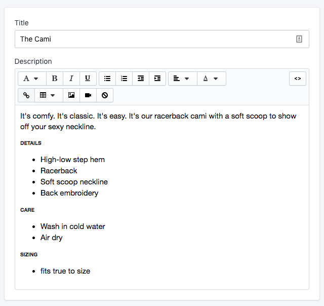
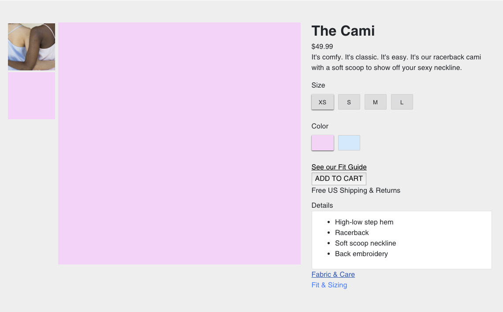

# Pixel Shopify Theme
Custom Shopify theme built by [Pixel Inc.](https://www.pixel-sf.com), originally designed for [No Plans NYC](https://www.noplansnyc.com)

## Local Development
Make sure to create a [self signed SSL certificate](https://github.com/Shopify/slate/wiki/4.-Create-a-self-signed-SSL-certificate) so that assets served locally, via https, are not blocked. If your IP address changes, you will need to create a new certificate before running yarn start.

## Color Variants
It is important that the names of your color variants are either one word or are connected with hyphens. For example: Blue, Purple, Yellow-Green, and Blood-Orange are all valid color variant names. The reason for this is because of the large amount of code that touches color variants; there is no easy way to localize and slugify these names.

## Variant Options
We have tried to avoid writing code that depends on variant option order, however this has proven to be difficult. To be safe, make sure when setting up your product variant options, that size is option1 and color is option2. 

## Controlling the order of collections
By default, shopify will display your collections in alphabetical order on your shop's collections page. You can control the order of collections by using a menu. If a menu named All Collections is not created already, you must create one (Online Store -> Navigation -> Add Menu). It is important that the handle of this menu is ```all-collections```. Then, add to this menu all collections in the order that you want them to appear on your shop's collections page.

## Product Images  
When uploading product images, make sure that the images have a 1:1 aspect ratio. In other words, use square images for best results with this theme.   

## Secondary Product Images
On the collections page, each collection contains a list of products. For each product, one image is displayed for each color variant. When a user hovers their mouse over a product image, a secondary image is displayed instead of the primary. To render the secondary image, a file must be present in the uploaded files (Settings -> Files) that matches the following naming convention:   

> {PRODUCT HANDLE}_{VARIANT COLOR}_hover.jpg

For example, the image corresponding to a product with handle of tshirt and a color variant blue should be named:   

> tshirt_blue_hover.jpg

***NOTE**: currently only .JPG files are supported.   

## Using a video as a product image
To use a video as a product image, you must first upload the video in mp4 format to Settings -> Files. You should name the file something like 'video_{PRODUCT_NAME}.mp4'. Then, from the shopify admin dashboard, insert the full name of the video as the alt text of the product image. This works because there is a JavaScript function (see src/scripts/templates/product.js) that pulls the filename from the alt attribute and inserts a video element into the DOM where the product image would be.

## Using a video as a lifestyle example image
To use a video as a lifestyle example image, you must first upload the video in mp4 format to Settings -> Files. You should name the file something like 'video_{EXAMPLE_NAME}.mp4'. Then, from the shopify admin dashboard select Customize theme. Then navigate to the home page and in the lifestyle section, either find the lifestyle section that you want to add a video to or insert a new lifestyle example. You will have to insert an image no matter what, then click the edit button under the image and insert the full name of the video as the alt text of the image. This works because there is a JavaScript function (see src/scripts/sections/homeLifestyle.js) that pulls the filename from the alt attribute and inserts a video element into the DOM where the product image would be.

## Product Color Swatches
Color swatches use both background-color and background-image css properties. The background color is set to the name of a particular variant color. For example if the variant color name is 'Blue', the background-color is set to blue. The background-image is set to look for an image uploaded to the store's ```/files``` (Settings -> Files) with the name ```<COLOR_NAME>.png```. If the image exists, it overrides the background-color.

## Product Details
On any product page, you can create a section of tabbable / collapsable details that give more information about a product. The details section on an individual product page can be customized by editing a product from the shopify admin dashboard. The details section currently supports 3 types of details:   
- details - product specific details  
- care - washing, etc. 
- sizing - fit and sizing details  

In the description editor, the following convention can be used to customize the details section:

1. The details section must appear last in the description editor, after any description of the product
2. Enter the text ```details``` (case doesn't matter) and format it as an Heading 6
3. Any text following the ```details``` header will be parsed as the content of a collapsable detail block (expanded/collapsed when the corresponding title is clicked) 
4. Enter the text ```care``` and format it as an Heading 6
5. Any text following the ```care``` header will be parsed as the content of a collapsable care block
6. Enter the text ```sizing``` and format it as an Heading 6
7. Any text following the ```sizing``` header will be parsed as the content of a collapsable sizing block

### Example: Editing the product description
  

### Example: Result


*NOTE: This is an anti-pattern, the product description is not where additional product information semantically belongs. This anti-pattern is being used because it makes the clients life easier. They shouldn't have to navigate through as many theme or section settings as there are products and update the information separately. With this anti-pattern, all product info lives on the product page in the admin dashboard for the client. Using this anti-pattern is acceptable because the client is small, the theme is custom, and it is not designed for general use.* 

## Dumping / Logging Variables
For most liquid objects, you can dump its contents into the console (via javascript) by using the following syntax:   

``   
